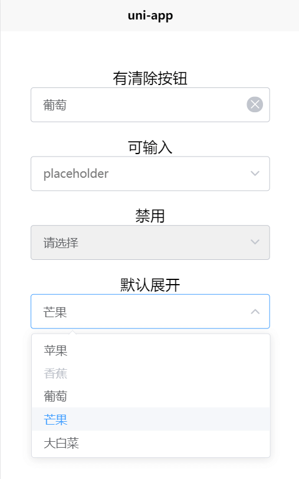

# hx_uniapp_compontent__xfl-select

这是 `HBuilerX` 的插件， 使用环境为 `uni-app`。  
是一个UI组件: 下拉列表。  

## 获取
github仓库: [https://github.com/xiafl/hx_uniapp_compontent__xfl-select](https://github.com/xiafl/hx_uniapp_compontent__xfl-select)  
  
## API说明
属性  
   
参数	| 说明	| 类型	| 可选值	| 默认值   
-- | -- | -- | -- | --   
list	| 要展示的数据	| Array	| —	| [ ]   
clearable	| 是否显示清除按钮	| Boolean	| —	| true   
initValue	| 第一次显示时默认选中的文本	| String	| —	| " "   
isCanInput	| 是否可以输入值	| Boolean	| —	| false   
placeholder	| 占位符	| String	| —	| "请选择"   
style_Container	| 组件根节点的行内样式	| String	| —	| " "   
disabled	| 是否禁用整个选择框	| Boolean	| —	| false   
showItemNum	| 显示列表的窗口高度，数字表示能显示几个列表项	| Number	| —	| 5   
listShow	| 第一次显示时是否显示列表	| Boolean	| —	| false   
  
list属性特别说明(设 数组元素为 item):
1. 如果 `typeof item === 'object' && 'value' in item`, 则取value的值，否则就用item作为显示项  
2. 如果 `typeof item === 'object' && item.disabled == true`, 则表示禁用本项，显示为灰色  
    
事件  
   
| 事件名称	| 说明	| 回调参数 |   
| -- | -- | -- |   
| blur	| 在 Input 失去焦点时触发 | (event: Event)   
| focus	| 在 Input 获得焦点时触发 | (event: Event)   
| change	| 	选中值发生变化时触发 | {newVal: value, oldVal: this.selectText, index: index, orignItem: this.list[index]}   
| visible-change	| 下拉框出现/隐藏时触发 | 出现则为 true，隐藏则为 false   
| clear	| 可清空的单选模式下用户点击清空按钮时触发 | --   
| confirm	| 当焦点在 Input 中时，按下回车键时触发 | --   
  
## 使用方法
  
```javascript
<templete>
	<view style="width: 80%; margin: auto; margin-bottom: 20px;">
		<xfl-select 
			:list="list"
			:clearable="false"
			:showItemNum="5" 
			:listShow="true"
			:isCanInput="true"  
			:style_Container="'height: 50px; font-size: 16px;'"
			:placeholder = "'placeholder'"
			:initValue="'苹果'"
		>
		</xfl-select>
	</view>
</templete>

<script>
import xflSelect from '../../components/xfl-select/xfl-select.vue';     //导入

export default {
	data() {
		return {
			list: [       //要展示的数据
				'苹果',
				{value: '香蕉', disabled: true},
				'葡萄',
				'芒果',
				'大白菜',
			],
		}
	},
	components: { xflSelect },  //注册为子组件
	
	/* 
		// 或者在 main.js 中注册为全局组件 
		import xflSelect from './components/xfl-select/xfl-select.vue';
		Vue.component('xfl-select', xflSelect);
	*/
}
</script>
```
  
## 效果
[**示例页面**](http://raw.githack.com/xiafl/hx_uniapp_compontent__xfl-select/master/test_select/unpackage/dist/build/h5/index.html)
   


## 权限
无 

## 问题反馈
如在使用中发现bug或有优化的建议和意见，请发邮件 <541151284@qq.com> 或在 [gitHub](https://github.com/xiafl/hx_uniapp_compontent__xfl-select) 上反馈。
  
## 更新日志
  
2019.6.27 ***v1.0.0***  创建本插件  
  